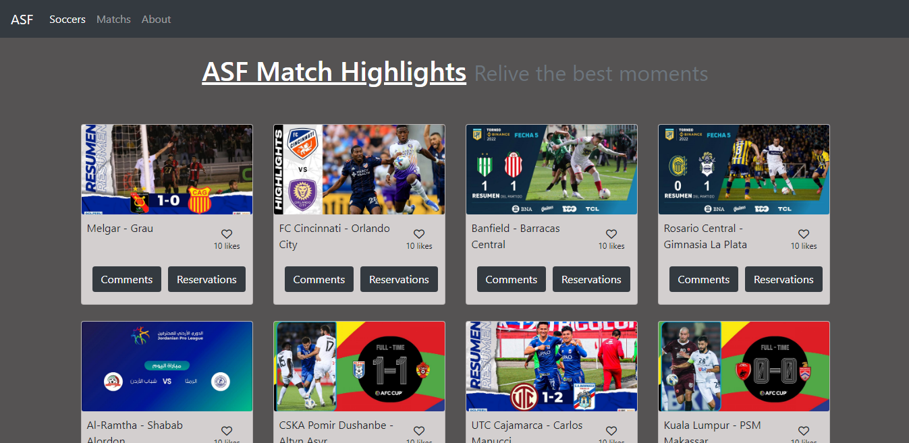
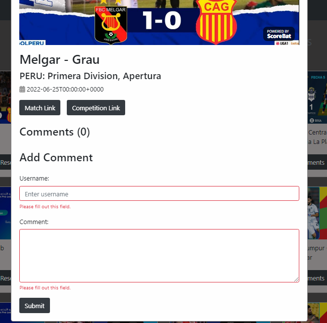
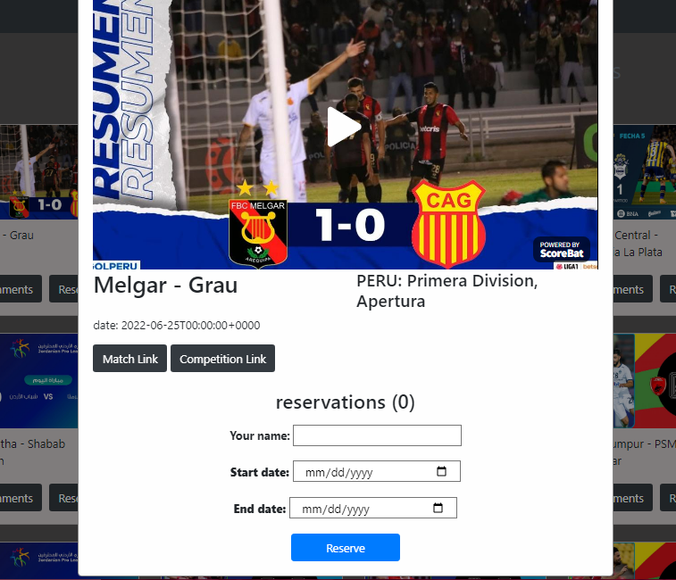
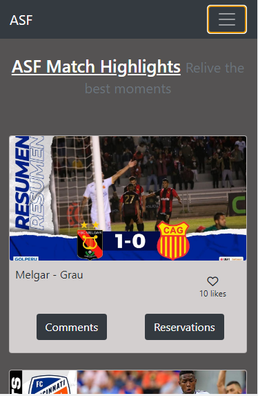

# JavaScript capstone project - ASF SOCCER SCOREBAT

This is an API-based website that record the different user interactions which includes likes, comments and reservations. Three interfaces are built and each of them shows the home page, comments popup and the reservation popup. When a user clicks on the "Comments" and "reservation" button, the expected popup appears.

This project was built using the scorebat API and microverse Involvement API.

## Major Technologies

HTML5/CSS
JAVASCRIPT(ES6)
REST API
NPM
WEBPACK
JEST LIBRARY

## Overview

### Screenshot






### Demo

[Link to Live demo]()

### Install & Setup

To setup and install this sample ASF Scorebat website, follow the below steps:

- Clone this project by the command:

```
$ git clone git@github.com:shahnawaza75/Capstone_js.git
```

- Then switch to the project folder by the bellow query:

```
$ cd Capstone_js
```

- Then run the below command to install dependencies

```
$ npm i
```

- Finally, run the below command to start the project.

```
$ npm start
```

## Run tests

To run the tests for linters locally, you must have node installed on your computer. Install the necessary packages. Run npx stylelint "\*/.{css,scss}" Run npx hint . Run npx eslint .

### Prerequisites

- IDE to edit and run the code (We use Visual Studio Code 🔥).
- Git to versionning your work.

### Authors

👤 **Ali Aqa Atayee**

- GitHub: [@aliatayee](https://github.com/aliatayee)
- Twitter: [@aqaatayee](https://twitter.com/aqaatayee)

👤 **Favour Amarachi Ezeugwa**

- GitHub: [@Favourezeugwa](https://github.com/Favourezeugwa)
- LinkedIn: [Favour Amarachi Ezeugwa](https://www.linkedin.com/in/favour-amarachi-ezeugwa-a5bb31149/)
- Twitter:[Favour_ezeugwa](https://twitter.com/Favour_ezeugwa)

👤 **Shahnawaza Ali**

- GitHub: [@shahnawaza75](https://github.com/shahnawaza75)
- Twitter: [@shahnawaza75](https://twitter.com/shahnawaza75)
- LinkedIn: [@shahnawaza75](https://www.linkedin.com/in/shahnawaz-ali-a24b72204)

## 🤝 Contributing

Contributions, issues, and feature requests are welcome!

Feel free to check the [issues page](../../issues/).

## Show your support

Give a ⭐️ if you like this project!

## Acknowledgments

- Hat tip to anyone whose code was used
- Inspiration
- etc

## 📝 License

This project is [MIT](./MIT.md) licensed.
